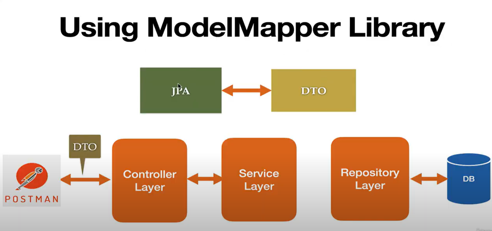

## Using ModelMapper Library (ModelMapper & MapStruct)

* https://modelmapper.org/
* https://mapstruct.org/

### Development Steps
- Add ModelMapper Maven Dependency
- Configure ModelMapper class as Spring bean
- Inject and use ModelMapper Spring bean in Service Class

